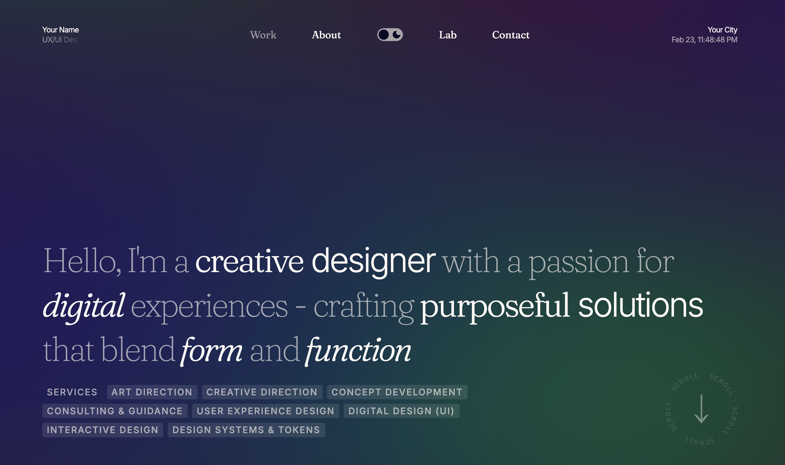

# Nuxt Portfolio GSAP

**Personal portfolio with buttery smooth animations**

[](https://nuxt-portfolio-gsap.netlify.app/)


[](https://app.netlify.com/start/deploy?repository=https://github.com/patsma/nuxt-portfolio-gsap)
[](https://vercel.com/new/clone?repository-url=https://github.com/patsma/nuxt-portfolio-gsap)

---



> **Note:** GSAP plugins (ScrollSmoother, SplitText, MorphSVG) are now **completely free** as of 2025!

## About

A custom-built portfolio featuring directive-based page transitions, smooth scrolling, and WebGL backgrounds. Every animation system is hand-crafted - no templates, no page builders, just clean TypeScript and GSAP.

What makes it technically interesting: SSR-compatible animations with zero FOUC, Safari-specific performance optimizations, and a unified timeline sequencer that coordinates entrance animations across components.

## Features

### Animation
- **Page Transitions** - Directive-based GSAP animations (`v-page-split`, `v-page-fade`, `v-page-clip`, `v-page-stagger`)
- **Entrance Animations** - Unified timeline sequencer for coordinated first-load animations
- **Smooth Scrolling** - ScrollSmoother with parallax effects (`data-speed`, `data-lag`)
- **Theme Morphing** - SVG icon morphing between dark/light states

### Performance
- **60fps Desktop** - Optimized GSAP animations with proper cleanup
- **Safari Fixes** - Height lock fix, enter animation timing, ScrollSmoother settings
- **Mobile Optimized** - Automatic frame rate reduction (60fps → 30fps)
- **FOUC Prevention** - SSR-injected theme script and `is-first-load` class scoping

### Visual
- **Fluid Gradient** - WebGL background with TresJS and custom GLSL shaders
- **Theme System** - Dark/light with GSAP color transitions
- **Headroom Header** - Auto-hide/show on scroll direction
- **Magnetic Effects** - Spring physics hover interactions

### Developer Experience
- **TypeScript** - Strict mode with full type coverage
- **Nuxt 4** - Latest features and Vue 3 Composition API
- **Well Documented** - Comprehensive `.claude/` system docs
- **Modular Architecture** - Clean separation of concerns

## Tech Stack

| Category  | Technology                                                                 |
| --------- | -------------------------------------------------------------------------- |
| Framework | Nuxt 4 (Vue 3)                                                             |
| Language  | TypeScript (strict mode)                                                   |
| Animation | GSAP with Club plugins - ScrollSmoother, SplitText, MorphSVG (now free!)   |
| 3D/WebGL  | TresJS with custom GLSL shaders                                            |
| Styling   | TailwindCSS v4 + SCSS                                                      |
| State     | Pinia                                                                      |

## Quick Start

### One-Click Deploy

[](https://app.netlify.com/start/deploy?repository=https://github.com/patsma/nuxt-portfolio-gsap)
[](https://vercel.com/new/clone?repository-url=https://github.com/patsma/nuxt-portfolio-gsap)

### Local Development

```bash
# Clone
git clone https://github.com/patsma/nuxt-portfolio-gsap.git
cd nuxt-portfolio-gsap

# Install
npm install

# Dev server (http://localhost:3000)
npm run dev

# Production build
npm run build
```

## Architecture

```
app/
├── composables/          # Animation & scroll logic
│   ├── usePageTransition.ts
│   ├── useScrollSmootherManager.ts
│   ├── useEntranceAnimation.ts
│   └── useThemeSwitch.ts
├── directives/           # Page transition directives
│   ├── v-page-split.ts
│   ├── v-page-fade.ts
│   ├── v-page-clip.ts
│   └── v-page-stagger.ts
├── components/           # Vue components
├── layouts/              # ScrollSmoother wrapper
└── pages/                # Route pages
```

## Documentation

Detailed system documentation lives in `.claude/`:

| Document                                               | Description                              |
| ------------------------------------------------------ | ---------------------------------------- |
| [LOADING_SYSTEM.md](.claude/LOADING_SYSTEM.md)         | Theme-aware loader & entrance animations |
| [THEME_SYSTEM.md](.claude/THEME_SYSTEM.md)             | Dark/light switching with GSAP           |
| [PAGE_TRANSITIONS.md](.claude/PAGE_TRANSITIONS.md)     | Directive-based transition system        |
| [SCROLL_SYSTEM.md](.claude/SCROLL_SYSTEM.md)           | ScrollSmoother & headroom integration    |
| [COMPONENT_PATTERNS.md](.claude/COMPONENT_PATTERNS.md) | Reusable section patterns                |
| [FLUID_GRADIENT.md](.claude/FLUID_GRADIENT.md)         | WebGL background system                  |
| [MAGNETIC_EFFECT.md](.claude/MAGNETIC_EFFECT.md)       | Spring physics hover effects             |

## Credits

Design & Development by [Morten Christensen](https://mschristensen.com) & [Patryk Smakosz](https://patryksmakosz.com)

## License

MIT
